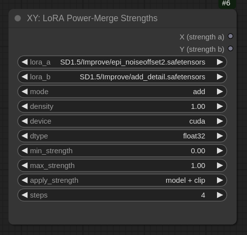
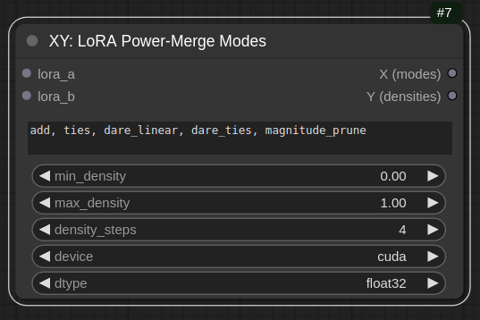
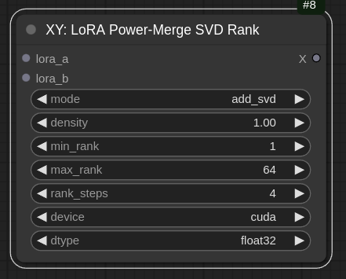

# LoRA Power-Merger ComfyUI
Full power on LoRA merge operations and their evaluation including dare merge, SVD support and XY plots. 

This is a fork and updated version of laksjdjf [LoRA Merger](https://github.com/laksjdjf/LoRA-Merger-ComfyUI)
Merging algorithms (ties, dare, magnitude pruning) are taken from [PEFT](https://github.com/huggingface/peft). XY plots require [efficiency nodes](https://github.com/jags111/efficiency-nodes-comfyui/).

## Nodes for merging LoRAs
This documentation provides an overview of LoraMerger and LoraSVDMerger nodes , which are designed to merge LoRA (Low-Rank Adaptation) models using various methods. 

### Lora Merger (PM Lora Merger)
The Lora Merger node is designed to merge multiple LoRA (Low-Rank Adaptation) models using various methods. It allows for combining different LoRA models by considering their up and down projection matrices and respective alpha values. The merging process is flexible, supporting different modes such as simple addition, ties, linear combination, and magnitude pruning. The main purpose of this class is to create a new LoRA model that encapsulates the characteristics of the input models, enhancing their overall performance or adapting them to new tasks.

**Parameters**
- `lora1`: The first LoRA model. <mark>After connecting the first LoRA, another LoRA connection point will appear, allowing an unlimited number of LoRAs to be merged.</mark> 
- `mode`: The merging mode ('add', 'ties', 'dare_linear', 'dare_ties', 'magnitude_prune').
- `density`: The density parameter for some merging modes (relevant for all dare, ties and magnitude pruning related modes).
- `device`: The device to use ('cuda' or 'cpu').
- `dtype`: The data type for computations ('float32', 'float16', 'bfloat16').

### LoRA SVD Merger (PM LoRA SVD Merger)
The Lora SVD Merger node focuses on merging LoRA models using Singular Value Decomposition (SVD). This approach decomposes the weight matrices into singular vectors and values, allowing for a more refined and controlled merging process. The SVD-based merging supports different modes and includes additional parameters for adjusting the rank of the decomposed matrices. The primary goal of this class is to produce a merged LoRA model that leverages the strengths of the input models while maintaining a low-rank representation, which is essential for efficient computation and memory usage.

- `lora1`: The first LoRA model. <mark>After connecting the first LoRA, another LoRA connection point will appear, allowing an unlimited number of LoRAs to be merged.</mark>
- `mode`: The merging mode ("add_svd", "ties_svd", "dare_linear_svd", "dare_ties_svd", "magnitude_prune_svd") using SVD.
- `density`: Density parameter for some merging modes (relevant for all dare, ties and magnitude pruning related modes).
- `svd_rank`: The new rank after SVD calculation.
- `svd_conv_rank`: The new convolution rank for SVD (in case of LoCon types).
- `device`: The device to use ('cuda' or 'cpu').
- `dtype`: The data type for computations ('float32', 'float16', 'bfloat16').

### Merging Modes

This is a brief overview about the different merging modes. These merging modes provide flexibility in how LoRA models are combined, allowing for different strategies to optimize the resulting model's performance based on the specific requirements of the task or application. For more details see [PEFT Merging](https://huggingface.co/blog/peft_merging).

- **add** 
This mode performs a straightforward addition of the projection matrices from the LoRA models. The weights are combined by summing them up, taking into account their respective strengths.

- **concat** 
Simple concatenation of the matrices. Only works for non SVD-merges.

- **ties** 
In this mode, the projection matrices are merged using a method called "ties," which involves a density parameter. The process aims to balance the weights based on their relative importance and density, resulting in a more nuanced combination.

- **dare_linear** 
The "dare_linear" mode uses a linear combination approach to merge the matrices. It scales and combines the weights linearly, ensuring that the resulting matrices reflect a proportional influence from each input model.

- **dare_ties** 
Similar to the "ties" mode, "dare_ties" also incorporates the density parameter but uses a different strategy to merge the matrices. It aims to retain more significant contributions from each model while considering their density.

- **magnitude_prune** 
This mode applies magnitude pruning to the projection matrices before merging them. It prunes less important weights based on their magnitude, combining only the most significant elements from each model.

<mark>In case of SVD, the modes are applied before SVD is involved.</mark> 

## Basic Nodes

Fundamental nodes for loading, applying, saving and resizing LoRAs.  

1. `LoRA Loader (PM LoRA Loader)` Load a LoRA to feed it into merging nodes. Additionally, the specified LoRA can be weighted module specific (lbw). Documentation can be found in the [inspire pack](https://github.com/ltdrdata/ComfyUI-extension-tutorials/blob/Main/ComfyUI-Inspire-Pack/tutorial/LoraBlockWeight.md).
2. `LoRA Save (PM LoRA Save)` Save a merged LoRA to disk.
3. `LoRA Apply (PM LoRA Apply)`  Apply a merged LoRA to a model.
4. `LoRA Resizer (PM LoRA Resize)` The LoraResizer class is designed to adjust the rank of a LoRA (Low-Rank Adaptation) model. LoRA models are used to fine-tune large neural networks efficiently by training low-rank projection matrices. The LoraResizer class enables converting these models to a different rank approximation, typically reducing the rank to decrease the model's complexity while maintaining performance.

## XY Plot Components

### XY: LoRA Power-Merge Strengths (XY: PM LoRA Strengths)
The `XY: LoRA Power-Merge Strengths` node is designed to 
generate combinations of LoRA (Low-Rank Adaptation) models by varying their 
strengths and apply these combinations to a stable diffusion pipeline.

**Parameters**
- `lora_a`: List of filenames for the first set of LoRA models.
- `lora_b`: List of filenames for the second set of LoRA models.
- `mode`:  mode of merging. "add", "ties", "dare_linear", "dare_ties", "magnitude_prune".
- `device`: The device to use ('cuda' or 'cpu').
- `dtype`: The data type for computations ('float32', 'float16', 'bfloat16').
- `min_strength`: lower bound for strength intervals
- `max_strength`: upper bound for strength intervals
- `apply_strength`: Specified where the strengths are applied on. If not applied, strength is set to zero. Options: "model + clip", "model", "clip".
- `steps`: Number of strength steps to generate

### XY: LoRA Power-Merge Modes (XY: PM LoRA Modes)
The `XY: LoRA Power-Merge Modes` class generates XY capsules that represent combinations 
of merging modes and density values for LoRA models. These capsules can be used 
to systematically evaluate the performance of different combinations on a 
neural network model.

**Parameters**
- `lora_a`: List of filenames for the first set of LoRA models.
- `lora_b`: List of filenames for the second set of LoRA models.
- `modes`:  Comma-separated string of merging modes. Default: "add, ties, dare_linear, dare_ties, magnitude_prune"
- `min_density`: lower bound for strength intervals
- `max_demsity`: upper bound for density intervals
- `density_steps`: Number of density steps to generate
- `device`: The device to use ('cuda' or 'cpu').
- `dtype`: The data type for computations ('float32', 'float16', 'bfloat16').

### XY: LoRA Power-Merge SVD Rank (XY: PM LoRA SVD Rank)
The `XY: LoRA Power-Merge SVD Rank` node generates XY capsules that represent 
combinations of SVD modes and rank values for merging LoRA models. 
These capsules can be used to systematically evaluate the performance 
of different combinations on a neural network model.

**Parameters**
- `lora_a`: List of filenames for the first set of LoRA models.
- `lora_b`: List of filenames for the second set of LoRA models.
- `mode`:  mode of merging. "add", "ties", "dare_linear", "dare_ties", "magnitude_prune".
- `density`: density parameter for density related merging algorithms.
- `min_rank`: lower bound for rank intervals
- `max_rank`: upper bound for rank intervals
- `rank_steps`: Number of density ranks to generate
- `device`: The device to use ('cuda' or 'cpu').
- `dtype`: The data type for computations ('float32', 'float16', 'bfloat16').
